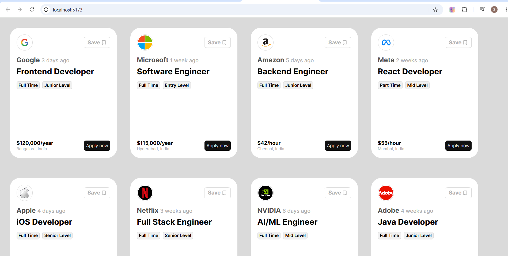

# React Job Cards

A simple React application that displays job listings using reusable components and dynamic rendering.

## Features

* Built with React and Vite
* Reusable Job Card component
* Dynamic rendering using `map()`
* Company logos and job details
* Responsive card layout
* Clean and modern UI

## Technologies Used

* React
* JavaScript
* CSS
* Vite

## Preview



## What I Learned

* Creating React components
* Passing props
* Rendering lists using `map()`
* Using unique keys
* Organizing project structure
* Styling React applications

## Installation

```bash
npm install
npm run dev
```

## Future Improvements

* Search jobs
* Filter by category
* Save/Favorite jobs
* API integration
* Backend support
